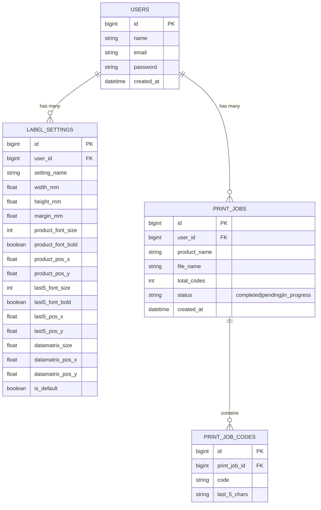

# DataMatrix Label Printing & Management Web Application (Laravel + HTML/CSS/JS + MySQL)

## 📋 Ծրագրի Նկարագրություն (Overview)
Պատրաստվելու է modern, արագագործ web application՝ նախատեսված CSV ֆայլերից կոդերի ներմուծման, DataMatrix բարկոդերի գեներացման, լեյբլների ձևաչափերի կարգավորման և **Xprinter XP-356B** (20x30մմ կամ այլ չափսի) պրինտերով տպագրության համար։

Ծրագիրն ունենալու է օգտատերերի աուտենտիկացիա (Login/Register), յուրաքանչյուր օգտատիրոջ համար առանձին պահպանվող լեյբլի կարգավորումներ, տպագրության պատմություն (History)՝ visual badges-ով, batch deletion-ով, CSV export-ով, ինչպես նաև Dashboard-ում CSV ֆայլի առաջին 5 տողերի preview-ի հնարավորություն։

---

## 🛠️ Տեխնոլոգիական Կույտ (Tech Stack)
- **Frontend**: HTML5, CSS3 (Tailwind CSS / Custom Glassmorphism UI), JavaScript (ES6+), BWIP-JS / DataMatrix JS Engine (High-DPI client rendering for thermal print precision)
- **Backend**: PHP 8.2+ / Laravel 11/12
- **Database**: MySQL (Local Dev support for SQLite/MySQL)
- **Target Printer**: Xprinter XP-356B (20x30mm roll labels, custom mm sizing)
- **Deployment Target**: cPanel Subdomain (`datamatrix.elab.am`)

---

## 🚀 Հիմնական Ֆունկցիոնալություն (Key Features)

### 1. 🔐 Օգտատերերի Աուտենտիկացիա (Auth System)
- Գրանցում (Register) և Մուտք (Login/Logout)
- Յուրաքանչյուր օգտատեր տեսնում է միայն իր ներբեռնած ֆայլերը, տպագրության պատմությունը և լեյբլի կարգավորումները։

### 2. 📁 CSV Import & Dashboard Preview
- CSV ֆայլի դաշտի (1 սյունյակով կոդեր) Upload drag-and-drop ինտերֆեյսով։
- **CSV Preview Component**: Ֆայլը ներբեռնելուց հետո Dashboard-ում ցուցադրվում է առաջին 5 տողերի աղյուսակը (Row #, Code, Last 5 Digits/Chars), որպեսզի օգտատերը ստուգի տվյալները տպելուց առաջ։
-  Batch-ի ապրանքի անվանման (Product Name) մուտքագրում (նույնն է տվյալ ֆայլի բոլոր կոդերի համար)։
- **5-նիշանոց կոդի առանձնացում**: Յուրաքանչյուր կոդի վերջին 5 նիշերը ավտոմատ ֆիլտրվում և ցուցադրվում են առանձին տեքստային դաշտում label-ի վրա։

### 3. ⚙️ Label Designer & Customization Settings (Saved Per User)
- Յուրաքանչյուր user-ի համար MySQL բազայում պահպանվող լեյբլի կարգավորումներ.
  - Label-ի չափսեր (Լայնություն `mm`, Բարձրություն `mm`, Օրինակ՝ `20mm x 30mm`)
  - Լեյբլի ուղղվածություն (Portrait / Landscape)
  - Product Name-ի տառաչափ (Font size), տառատեսակի ոճ (Bold/Normal), X/Y կոորդինատներ
  - Վերջին 5 նիշերի (Last 5 chars) տառաչափ, Bold/Normal, X/Y կոորդինատներ
  - DataMatrix կոդի չափսեր (mm/px) և X/Y տեղադրություն label-ի վրա
- **Interactive Live Label Preview**: Real-time տեսանելի փոփոխություն Dashboard-ում / Designer-ում կարգավորումները փոխելիս։

### 4. 🖨️ Xprinter XP-356B Thermal Printing Engine & Safeguards
- Exact `@media print` CSS՝ փոխանցելով `20mm x 30mm` page size-ը և 0 margins-ը, որպեսզի Xprinter XP-356B պրինտերը տպի ճշգրիտ մեկ առ մեկ՝ առանց շեղումների։
- **Performance Safeguards (Ծրագիրը չկախելու համար)**:
  - Client-side chunking & virtualized printing buffer.
  - Մեծ CSV ֆայլերի (օրինակ՝ 5,000+ կոդ) դեպքում տպագրական preview-ն կատարվում է pagination/chunking եղանակով, որպեսզի բրաուզերը կամ backend-ը չկախվեն։
  - Backend-ում batch SQL multi-insert optimisation.

### 5. 📜 Print History (Պատմություն) & Management Features
- Տպագրությունների աղյուսակ (Batch ID, Product Name, File Name, Total Codes, Status, Created At, Actions)։
- **Visual Status Badges**:
  - `Completed` (Կանաչ badge)
  - `Pending` (Դեղին/Նարնջագույն badge)
  - `In Progress` (Կապույտ badge)
- **Batch Deletion Feature**:
  - Multi-select checkboxes History աղյուսակում + "Ջնջել ընտրվածները" (Delete Selected) ընդհանուր кнопка confirmation modal-ով։
- **Export History to CSV**:
  - "Արտահանել CSV" (Export CSV) button History էջում՝ պատմությունը ներբեռնելու համար։
- Detailed View & Re-print batch հնարավորություն։

### 6. 📄 Legal Pages & Footer Attribution
- **Օգտագործման պայմաններ** (Terms of Use) էջ/modal
- **Գաղտնիության քաղաքականություն** (Privacy Policy) էջ/modal
- **Footer**: `Համակարգը պատրաստված է սիրով elab.am-ի կողմից`

---

## 🗄️ Տվյալների Բազայի Սխեմա (Database Schema)



---

## 📂 Պրոյեկտի Կառուցվածքը (Proposed File Structure)

```
Datamatrix/
├── app/
│   ├── Http/
│   │   ├── Controllers/
│   │   │   ├── AuthController.php
│   │   │   ├── DashboardController.php
│   │   │   ├── CsvImportController.php
│   │   │   ├── LabelSettingController.php
│   │   │   ├── HistoryController.php
│   │   │   └── LegalController.php
│   │   └── Middleware/
│   └── Models/
│       ├── User.php
│       ├── LabelSetting.php
│       ├── PrintJob.php
│       └── PrintJobCode.php
├── database/
│   ├── migrations/
│   └── seeders/
├── resources/
│   ├── views/
│   │   ├── layouts/
│   │   │   └── app.blade.php
│   │   ├── auth/
│   │   │   ├── login.blade.php
│   │   │   └── register.blade.php
│   │   ├── dashboard/
│   │   │   ├── index.blade.php
│   │   │   └── partials/
│   │   │       ├── csv_preview.blade.php
│   │   │       └── label_designer.blade.php
│   │   ├── history/
│   │   │   └── index.blade.php
│   │   ├── legal/
│   │   │   ├── terms.blade.php
│   │   │   └── privacy.blade.php
│   │   └── print/
│   │       └── label_sheet.blade.php
│   ├── css/
│   │   └── app.css
│   └── js/
│       ├── app.js
│       ├── datamatrix_generator.js
│       ├── label_designer.js
│       └── print_engine.js
├── routes/
│   └── web.php
└── public/
    └── .htaccess
```

---

## 🌐 cPanel Տեղադրման Ուղեցույց (`datamatrix.elab.am`)
1. **Subdomain Setup**: cPanel-ում ստեղծել `datamatrix.elab.am` դոմենը և Document Root-ը սահմանել `public_html/datamatrix/public` (կամ root directory `/public` folder-ը)։
2. **Database Creation**: cPanel MySQL Database Wizard-ով ստեղծել բազան և օգտատիրոջը։
3. **Environment (.env)**: Config-ում դնել `APP_ENV=production`, `APP_URL=https://datamatrix.elab.am` և MySQL կոնֆիգուրացիան։
4. **Optimization**: Աշխատեցնել `php artisan config:cache`, `route:cache`, `view:cache`։

---

## 🧪 Ստուգման և Թեստավորման Պլան (Verification Plan)

### Automated & Unit Tests
- `php artisan test`՝ Auth, CSV upload validation, Settings controller & History batch deletion թեստերի համար։

### Manual Verification
1. **Auth Test**: Գրանցվել, մուտք գործել, դուրս գալ։
2. **CSV Upload & Preview**: Upload անել test CSV, ստուգել Dashboard-ում առաջին 5 տողերի ճշգրիտ preview-ն և 5-նիշանոց կոդի ֆիլտրումը։
3. **Label Designer**: Փոխել տառաչափերը, X/Y դիրքերը, DataMatrix-ի չափսը -> պահպանել -> ստուգել real-time preview-ն և բազայում պահպանումը։
4. **Print Formatting**: Test տպել Xprinter 20x30mm ձևաչափով (print preview բրաուզերում)։
5. **History Operations**:
   - Ստուգել Status Badge-երը (`Completed`, `Pending`)։
   - Select անել մի քանի պատմության գրանցում -> Batch Delete -> ստուգել ջնջումը։
   - Սեղմել "Export CSV" -> ստուգել ներբեռնված CSV-ն։
6. **Footer & Legal**: Ստուգել Terms, Privacy էջերը և "Համակարգը պատրաստված է սիրով elab.am-ի կողմից" տեքստը footer-ում։
